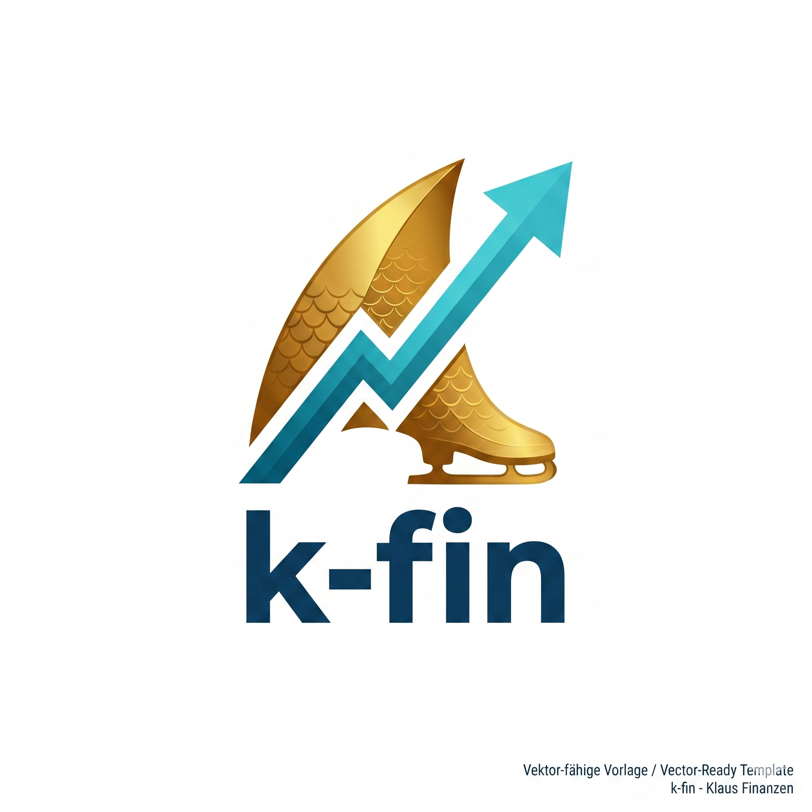

<p align="center">
  
</p>

# 🏦 K-Fin (Personal Finance Intelligence Platform)

**Read-only financial data platform powered by the Comdirect REST API — CSV export, Finance API, and normalization pipeline.**

> I built this for myself. It works for me. If it is useful to you, great — but this comes with no guarantees and no support.

## What it does

Connects to the Comdirect REST API (read-only), normalizes your financial data into a local Postgres database, and serves it via a Finance API. Also supports CSV/JSON export for AI agents and dashboards.

- **Comdirect connector** — OAuth2 + pushTAN authentication, strictly read-only
- **CSV/JSON export** — Accounts, transactions, depot positions, depot transactions, financial overview
- **Finance API** — REST API for normalized financial data (transactions, categorization)
- **Normalization pipeline** — Ingests raw Comdirect data into a canonical schema in Postgres
- **Docker / Kubernetes** — Two-microservice architecture: public API + internal worker
- **Firefly III import** — Legacy (frozen / not maintained)

## Architecture

The project is split into two microservices with strict secret separation:

| Service | Port | Role | Bank Secrets |
|---------|------|------|-------------|
| **comdirect-api** | 8000 | Public-facing read-only API | No |
| **comdirect-worker** | 8001 | Internal export/sync worker | Yes |

A Kubernetes NetworkPolicy ensures only `comdirect-api` can reach `comdirect-worker`. Both services share a PVC for exported data.

### Source Modules

| Module | Description |
|--------|-------------|
| `src/connector/` | Comdirect API client (auth, accounts, transactions, depot) |
| `src/api/` | Read-only FastAPI serving CSV exports (comdirect-api) |
| `src/normalization/` | Ingest + canonicalize pipeline for Postgres |
| `src/exporter/` | Finance agent mapper + model-based JSON export |
| `src/scheduler/` | Sync job orchestration (comdirect-worker) |
| `src/core/` | Config (pydantic-settings), logging, DB models |
| `scripts/` | Export script, auth test, debug tools |

## Tech Stack

| Component | Technology |
|-----------|------------|
| Language | Python 3.13 |
| Package manager | uv |
| HTTP client | httpx (async) |
| API | FastAPI + uvicorn |
| Config | pydantic-settings, .env |
| Containers | Docker, docker-compose |
| Releases | semantic-release |

## Prerequisites

- Python 3.13+ and uv
- Comdirect API credentials (Client ID, Client Secret, account number, PIN)
- A pushTAN-capable device for authentication
- Docker (optional, for container setup)

## Setup

```bash
git clone https://github.com/max5800/comdirect-firefly-sync.git
cd comdirect-firefly-sync
cp .env.example .env
# Fill in your credentials in .env
uv sync
```

## Usage

### Export to CSV

```bash
uv run python scripts/export_csv.py --output-dir exports
```

This triggers the Comdirect OAuth flow (including pushTAN confirmation) and writes CSV files to `exports/`.

### Start the REST API

```bash
uv run uvicorn main:app --reload
```

The API serves the exported CSVs at `http://localhost:8000`.

### Docker

```bash
docker-compose up
```

## Kubernetes

Deploy via the **Helm chart** in `chart/` (or **Tilt** for local development):

```bash
# Local dev
tilt up --stream -- --profile=local

# Remote
helm upgrade --install comdirect-sync ./chart -f dev/values.remote.yaml
```

The chart deploys two microservices:

- **comdirect-api** (port 8000) — public-facing, read-only API. No bank credentials. Triggers syncs by calling the worker.
- **comdirect-worker** (port 8001) — internal only. Holds Comdirect credentials via ExternalSecret/Vault. A NetworkPolicy restricts ingress to `comdirect-api` only.

Both services share a PVC for exported data.

See `docs/kubernetes-deployment.md` for the full deployment guide.

## API

| Endpoint | Description |
|----------|-------------|
| `GET /exports?token=...` | List all available CSV files |
| `GET /exports/latest?token=...` | Latest file per export category |
| `GET /exports/{filename}?token=...` | Download a specific CSV |

Set `API_TOKEN` in your `.env` to require authentication.

## Important Security & Architecture Note

- **Manual pushTAN is a feature, not a bug:** Because Comdirect does not offer scoped read-only API tokens, requiring a manual pushTAN confirmation for every sync is a deliberate security boundary. It ensures no automated system can quietly access your bank data or initiate sessions without your physical device approval.
- **Your credentials never leave your machine.** All data flows from Comdirect into your local Postgres DB via the normalization pipeline.
- Never commit your `.env` file. It contains banking credentials.

## Built with AI

This project was built with AI-assisted development (primarily Claude via OpenClaw). Architecture, security rules, and code were collaboratively developed — but every merge went through a human review. AI writes code; humans decide what ships.

## License

MIT